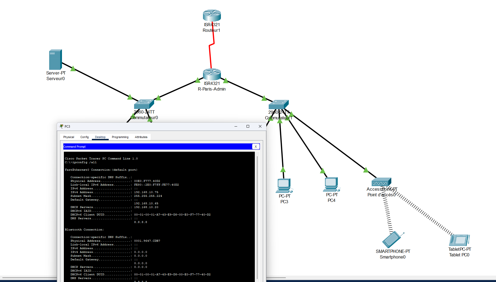
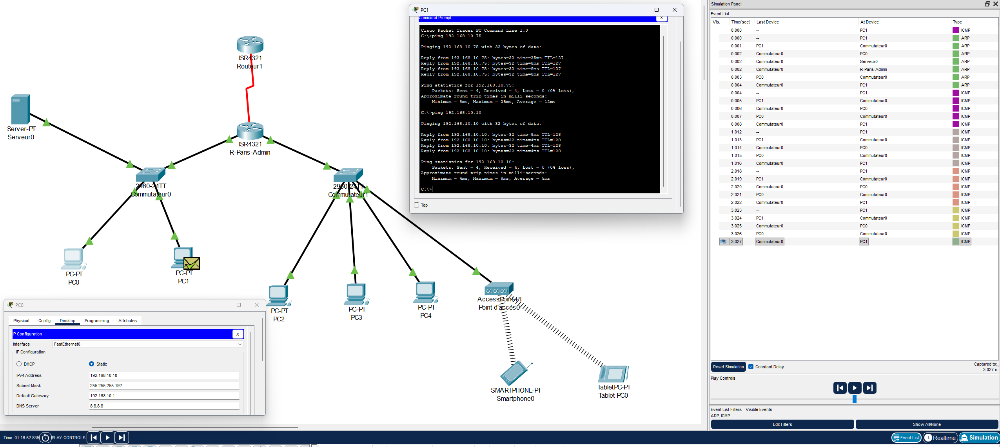
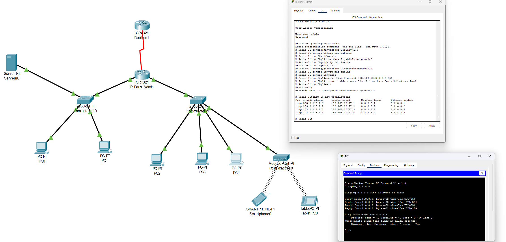

# Conception et Implémentation d'une Infrastructure Réseau SOHO

 

## 📝 Résumé du Projet
Ce projet de Master vise à concevoir, déployer et valider une architecture réseau complète pour une structure de type **SOHO (Small Office / Home Office)**. L'infrastructure simule un environnement de production intégrant adressage dynamique, routage, segmentation (VLANs) et accès sécurisé vers un FAI simulé.

## 1. Architecture Globale
L'infrastructure repose sur une topologie hiérarchique centrée autour d'un routeur de bordure (ISR4321) assurant l'interconnexion entre le réseau local (LAN), le réseau sans-fil (WLAN) et le fournisseur d'accès Internet (WAN).

*Figure 1 : Vue d'ensemble de la topologie logique, incluant les zones commutées (Switchs 2960), le serveur de services et les terminaux clients.*

---

## 2. Gestion et Automatisation (DHCP)
Afin de simplifier l'administration des hôtes, le protocole DHCP a été déployé sur le routeur central. La capture ci-dessous valide l'allocation automatique des paramètres réseau (IP, Masque, Passerelle, DNS) aux clients.

*Figure 2 : Validation de la configuration IP dynamique sur un poste client via la commande `ipconfig /all`.*

---

## 3. Tests de Connectivité

### A. Connectivité Interne (LAN)
Validation de la commutation et du routage interne entre deux hôtes du réseau local. Ce test confirme que la couche 2 (VLANs/Trunks) et la couche 3 (Routage Inter-VLAN) sont fonctionnelles.

*Figure 3 : Test ICMP réussi (Ping) entre PC1 et PC0, validant la communication sur le LAN.*

### B. Connectivité Externe (WAN & NAT)
Le test critique consiste à joindre l'adresse simulée du FAI (`8.8.8.8`). Le succès de ce ping valide la mise en œuvre du **NAT**, permettant aux adresses privées internes d'être traduites en adresse publique routable.

*Figure 4 : Succès des requêtes vers le réseau extérieur, confirmant le bon fonctionnement de la passerelle par défaut et de la traduction d'adresses.*

---

## 4. Analyse Protocolaire (Modèle OSI)
L'utilisation du mode simulation permet d'inspecter l'encapsulation des données. Ici, nous analysons un segment de la couche Transport (Layer 4) généré lors d'une requête DHCP.

*Figure 5 : Inspection d'un PDU (Protocol Data Unit) mettant en évidence l'utilisation du protocole **UDP** (User Datagram Protocol), choisi pour sa rapidité et son mode non-connecté, adapté aux diffusions DHCP.*

---

## Note Technique
* **Simulation DNS :** L'environnement Packet Tracer ne simulant pas un "vrai" Internet, la résolution DNS récursive vers des domaines réels (ex: google.com) n'est pas fonctionnelle. La validation de la connectivité WAN repose donc sur l'accessibilité IP (Ping 8.8.8.8) qui prouve le routage et le NAT.

## Installation
1.  Cloner le dépôt.
2.  Ouvrir le fichier `.pkt` avec Cisco Packet Tracer (v8.0+).
3.  Laisser le réseau converger (Spanning-Tree).
