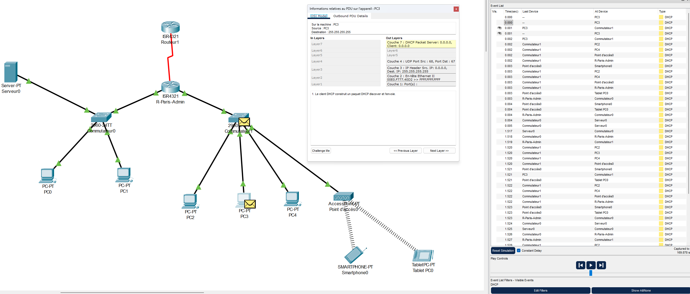

# 📡 Conception et Implémentation d'une Infrastructure Réseau SOHO

 

Une infrastructure réseau complète simulant un environnement d'entreprise (SOHO), axée sur la sécurité, la segmentation et l'automatisation des services.

## ✨ Technologies & Concepts
* **Environnement:** Cisco Packet Tracer (v8.2), Cisco IOS.
* **Réseau (L3):** Routage statique, NAT/PAT Overload, DHCP.
* **Sécurité:** SSH Hardening, ACLs, Segmentation VLAN.
* **Sans-fil:** WLAN sécurisé pour réseau invité.
* **Protocoles:** TCP/IP, UDP, ICMP, DNS, HTTP.

## 🚀 Fonctionnalités Clés

### 🔒 Sécurité & Accès
* **Hardening des Équipements :** Accès administratif sécurisé via SSH (vs Telnet) et chiffrement des mots de passe.
* **Isolation du Trafic :** Segmentation stricte entre le réseau de production (LAN) et le réseau invité (WLAN).

### 🌐 Connectivité & Routage
* **Accès Internet Partagé :** Implémentation du **NAT Overload** permettant à tous les périphériques de sortir via une IP publique unique.
* **Mobilité :** Réseau Wi-Fi fonctionnel pour tablettes et smartphones avec adressage dédié.

### ⚙️ Automatisation
* **Serveur DHCP Centralisé :** Allocation dynamique des adresses IP, passerelles et DNS pour réduire la configuration manuelle.
* **Services Internes :** Simulation d'un serveur DNS local et HTTP pour les tests applicatifs.

## 📸 Aperçu du Projet

### 1. Architecture Globale
Vue d'ensemble de la topologie en étoile étendue.

### 2. Preuve de Connectivité (NAT)
Le Ping vers `8.8.8.8` confirme que le réseau interne accède à Internet via la translation d'adresse.

### 3. Analyse Technique (Modèle OSI)
Inspection d'un paquet UDP montrant le fonctionnement interne du protocole DHCP.

*(D'autres captures de validation sont disponibles dans le dossier `/Images`)*

## 🚀 Installation
Ce projet ne nécessite aucune compilation.
1.  Cloner le dépôt.
2.  Ouvrir le fichier `.pkt` avec Cisco Packet Tracer (v8.0+).
3.  Attendre que les voyants oranges passent au vert (Convergence STP).